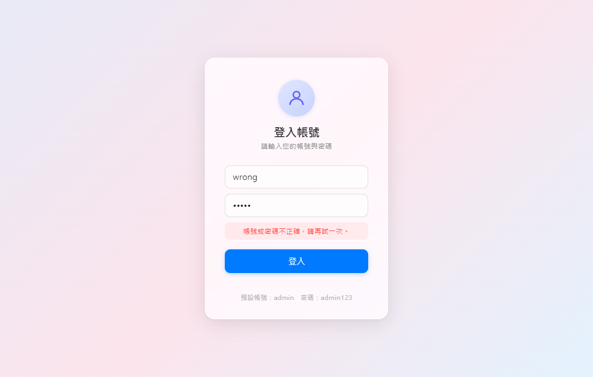

# DeskatopApp

Windows / macOS / Linux 桌面應用程式，以 Electron + React 開發，登入頁面採 macOS Big Sur 毛玻璃淺色風格，驗證串接 PostgreSQL 資料庫（bcrypt 密碼雜湊）。

## 畫面預覽

| 登入頁面 | 錯誤提示 | 登入成功 |
|---|---|---|
|  |  |  |

## 技術棧

| 層級 | 選擇 |
|---|---|
| 桌面運行時 | Electron 33 |
| 建置工具 | electron-vite 3 |
| 前端框架 | React 18 + Vite |
| 樣式 | 純 CSS（backdrop-filter 毛玻璃） |
| 資料庫 | PostgreSQL（node-postgres + bcryptjs） |
| 打包工具 | electron-builder（NSIS / DMG / AppImage） |

## 快速開始

```bash
# 安裝依賴
npm install

# 設定環境變數（複製並修改）
cp .env.example .env

# 開發模式（熱重載）
npm run dev

# 建置
npm run build

# 打包安裝檔
npm run build:win    # Windows NSIS installer → dist/
npm run build:mac    # macOS DMG（需在 macOS 機器）→ dist/
npm run build:linux  # Linux AppImage + deb → dist/

# 重新產生 App icon（三平台）
npm run gen:icons

# Playwright smoke test
node scripts/verify.mjs   # 截圖輸出至 tmp/shots/
```

## 環境變數設定

複製 `.env.example` 為 `.env` 並填入資料庫資訊：

```env
PORT=3000

DB_HOST=localhost
DB_PORT=5432
DB_NAME=wmsm
DB_USER=postgres
DB_PASSWORD=your_password
```

**打包版（已安裝的 .exe）：** `.env` 已透過 `extraResources` 自動打包進安裝檔，安裝後放在 `resources\.env`，重新安裝時會一併更新，無需手動複製。

## 專案結構

```
├── src/
│   ├── main/index.js          # Electron 主程序、DB 連線、IPC 處理
│   ├── preload/index.js       # contextBridge IPC 橋接
│   ├── renderer/              # React 前端（頁面、元件、樣式）
│   ├── api/                   # （規劃中）IPC client 抽象層
│   └── persistence/           # （規劃中）DB 存取層
├── docs/
│   ├── architecture.md        # 架構說明
│   ├── decisions/             # ADR 決策記錄
│   └── runbooks/              # 操作手冊
├── .claude/
│   ├── settings.json          # Claude Code 設定
│   ├── hooks/                 # 自動化 guardrails
│   └── skills/                # 可重用 AI 工作流程
│       ├── code-review/
│       ├── refactor/
│       └── release/
├── build/                     # App icon 資源（.ico / .icns / .png）
├── tools/
│   └── scripts/generate-icons.mjs  # 產生三平台 icon
├── scripts/verify.mjs         # Playwright 自動化截圖驗證
├── .env.example               # 環境變數範本
├── electron.vite.config.js
└── package.json
```

## 資料庫

需要 PostgreSQL 資料庫 `wmsm`，內含 `users` 表格：

```sql
CREATE TABLE users (
  id       SERIAL PRIMARY KEY,
  username VARCHAR(100) NOT NULL UNIQUE,
  password VARCHAR(255) NOT NULL  -- bcrypt hash（$2b$...）
);
```

密碼欄位支援 bcrypt hash（`$2b$...`）與明文舊帳號（向下相容）。

## 已知待改善項目

| 優先 | 項目 | 狀態 |
|---|---|---|
| 🔴 高 | 密碼 bcrypt 驗證 | ✅ 已修復（bcrypt.compare） |
| 🔴 高 | Pool 無錯誤監聽 | ✅ 已修復（pool.on('error')） |
| 🟠 中 | 錯誤訊息外洩 | ✅ 已修復（回傳通用提示） |
| 🟠 中 | Auth 狀態未伺服器驗證 | 待辦 |
| 🟡 低 | `sandbox: false` | 待辦 |
| 🟡 低 | `window.electronAPI` 無 null-check | ✅ 已修復（?.login()） |
| 🟡 低 | IPC 無型別 / 長度驗證 | ✅ 已修復 |
